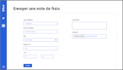
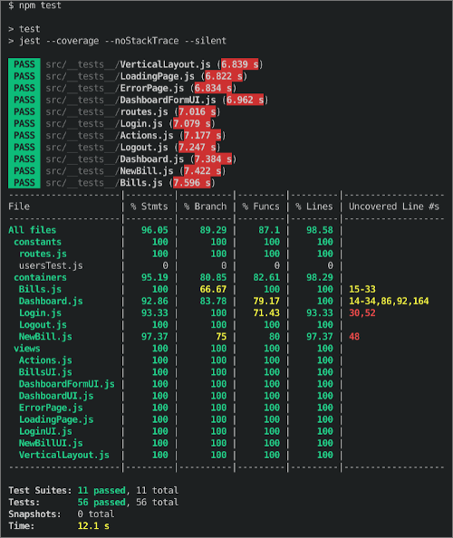

[](https://developer.mozilla.org/fr/docs/Glossary/HTML5)
[](https://developer.mozilla.org/fr/docs/Web/CSS)
[](https://jestjs.io/)
[](https://www.cypress.io/)
[](https://javascript.info/)


[](./Slide_P9.pdf) - SlideShow
[](./End-to-end_plan_test.pdf) - End-to-end plan test

[Application setup](#larchitecture-du-projet-)

[JEST Tests](#les-tests-jest)

[End-to-end CYPRESS Tests](#les-tests-end-to-end-avec-le-framework-cypress)


# [Application setup :](#larchitecture-du-projet-)
This project, called frontend, is connected to a backend API service that you must also launch locally.

The backend project can be found here:

 https://github.com/OpenClassrooms-Student-Center/Billed-app-FR-back

## Organize your workspace :


For a good organization, you can create a bill-app folder in which you will clone the backend project and later on, the frontend project.

**Clone the back-end project** into the bill-app folder:

```
$ git clone https://github.com/Peanuts-83/Billed-app-FR-Back.git
```

**Clone the front-end project** into the bill-app folder:

```
$ git clone https://github.com/Peanuts-83/Billed-app-FR-Front.git
```

```
bill-app/
   - Billed-app-FR-Back
   - Billed-app-FR-Front
```

## How to use the application localy ?

### Step 1 - Launch back-end API :

Follow the instructions on the back-end's README.

### Step 2 - Launch front-end application :

Go into the local repository :
```
$ cd Billed-app-FR-Front
```

Install dependencies :
```
$ npm install
```

Install live-server to enable local server :
```
$ npm install -g live-server
```

Launch the application :
```
$ live-server
```

The application URL is : `http://127.0.0.1:8080/`

&nbsp;
# [JEST Tests](#les-tests-jest)

Tests coverage objectives are 80% - Objectives exceeded : 96.05% reached.



## HOW to run all JEST Tests locally ?

```
$ npm run test
```

## How to run a single test ?

Install jest-cli :

```
$npm i -g jest-cli
$jest src/__tests__/your_test_file.js
```

## How to display tests coverage ?

`http://127.0.0.1:8080/coverage/lcov-report/`

## Accounts & users

You can use the application using this accounts:

### admin :
```
user : admin@test.tld
password : admin
```
### employee :
```
user : employee@test.tld
password : employee
```

The test files are here : [*./src/__tests__/*](./src/__tests__/)

&nbsp;
# [End-to-end CYPRESS Tests](#les-tests-end-to-end-avec-le-framework-cypress)


I personally developed a test suite for the "employee" part of the project, with the [Cypress test framework](https://www.cypress.io/) which is an easy-to-use all-in-one framework, and which has a graphical representation of the execution of the tests (big advantage for a beginner!). The programming syntax, close to that of Jest, is strongly semantic and very intuitive.


&nbsp;
Launch CYPRESS
* You can use npx :
```
npx cypress open
```
* Without npx :
```
./node_modules/.bin/cypress open
```
You can choose at the top right of the window that opens the test browser you want to use (firefox, chrome, ...).
Then just select the only test available: *End-to-End.spec.js*


&nbsp;
The test file is here : [*./cypress/integration/End-to-End.spec.js*](./cypress/integration/End-to-End.spec.js)